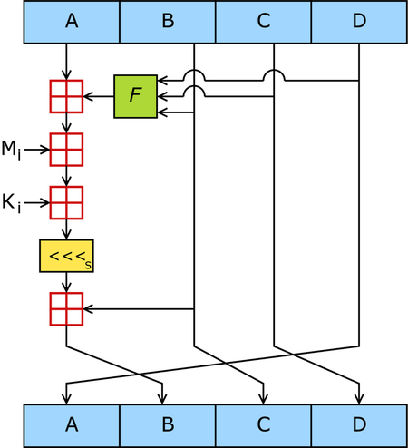
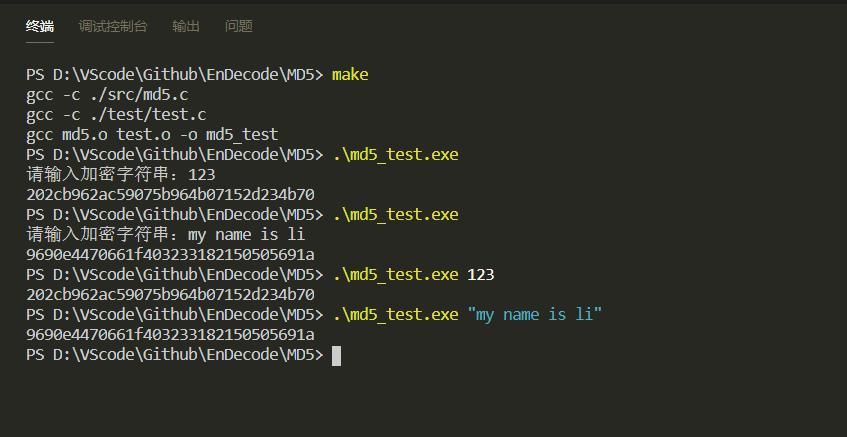

# MD5

MD5消息摘要算法（英语：MD5 Message-Digest Algorithm），一种被广泛使用的密码散列函数，可以产生出一个128位（16字节）的散列值（hash value），用于确保信息传输完整一致。MD5由美国密码学家罗纳德·李维斯特（Ronald Linn Rivest）设计，于1992年公开，用以取代MD4算法。这套算法的程序在 RFC 1321 中被加以规范。

将数据（如一段文字）运算变为另一固定长度值，是散列算法的基础原理。

## 1. 历史与密码学
1992年8月，罗纳德·李维斯特向互联网工程任务组（IETF）提交了一份重要文件，描述了这种算法的原理。由于这种算法的公开性和安全性，在90年代被广泛使用在各种程序语言中，用以确保资料传递无误等。

MD5由MD4、MD3、MD2改进而来，主要增强算法复杂度和不可逆性。

## 2. 应用
MD5曾被用于文件校验、SSL/TLS、IPsec、SSH，但MD5早已被发现有明显的缺陷。

1996年后被证实存在弱点，可以被加以破解，对于需要高度安全性的资料，专家一般建议改用其他算法，如SHA-2。2004年，证实MD5算法无法防止碰撞攻击，因此不适用于安全性认证，如SSL公开密钥认证或是数字签名等用途。

2009年，中国科学院的谢涛和冯登国仅用了220.96的碰撞算法复杂度，破解了MD5的碰撞抵抗，该攻击在普通计算机上运行只需要数秒钟。2011年，RFC 6151 禁止MD5用作密钥散列消息认证码。

## 3. MD5散列
一般128位的MD5散列被表示为32位十六进制数字。以下是一个43位长的仅ASCII字母列的MD5散列：

MD5("The quick brown fox jumps over the lazy dog")
= 9e107d9d372bb6826bd81d3542a419d6

即使在原文中作一个小变化（比如用c取代d）其散列也会发生巨大的变化：

MD5("The quick brown fox jumps over the lazy cog")
= 1055d3e698d289f2af8663725127bd4b

空文的散列为：
MD5("") = d41d8cd98f00b204e9800998ecf8427e

## 4. 算法 
MD5是输入不定长度信息，输出固定长度128-bits的算法。经过程序流程，生成四个32位数据，最后联合起来成为一个128-bits散列。基本方式为，求余、取余、调整长度、与链接变量进行循环运算。得出结果。

$$
\begin{aligned}
    F(X,Y,Z) &= (X\wedge{Y}) \vee (\neg{X} \wedge{Z})\\
    G(X,Y,Z) &= (X\wedge{Z}) \vee (Y \wedge \neg{Z})\\
    H(X,Y,Z) &= X \oplus Y \oplus Z\\
    I(X,Y,Z) &= Y \oplus (X \vee \neg{Z})\\
\end{aligned}
$$

$\oplus, \wedge, \vee, \neg$ 是 ''XOR'', ''AND'', ''OR'' , ''NOT'' 的符号。

**Figure**

1. 一个MD5运算由类似的64次循环构成，分成4组16次。

   > 第一组用 F，第一组用 G，第一组用 H，第一组用 I

2. F 一个非线性函数；一个函数运算一次。

3. Mi 表示一个 32-bits 的输入数据，Ki 表示一个 32-bits 常数，用来完成每次不同的计算。

## 5. 代码

**（1）代码**

[MD5](https://github.com/2950833136/EnDeCode/tree/master/MD5): https://github.com/2950833136/EnDeCode/tree/master/MD5

**（2）结果**

命令

> make
>
> .\md5_test.exe
>
> .\md5_test.exe "my name is li"  

